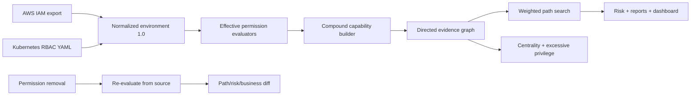

# Identity Attack Graph

**Evidence-backed attack paths across AWS IAM and Kubernetes RBAC.**

[](https://github.com/Vincent-P-essy/identity-attack-graph/actions/workflows/ci.yml)
[](pyproject.toml)
[](LICENSE)

Identity Attack Graph ingests a normalized identity environment, evaluates a
documented subset of AWS IAM and Kubernetes RBAC semantics, derives only
complete exploit primitives, and searches weighted paths from low-privilege
entrypoints to configured crown jewels. Every edge retains the policy statement,
binding, trust relation, or workload property that justified it.

The engine is deterministic and does not use a language model to infer
permissions or causality. It is a portfolio-grade analysis prototype over
synthetic data, not a replacement for AWS IAM Access Analyzer, Kubernetes
authorization checks, or a production cloud-security platform.

## Measured evidence

| Measurement | Reviewed result | Scope |
|---|---:|---|
| Expected semantic paths | **7/7 (100% recall)** | Manually reviewed synthetic lab |
| Unexpected paths | **0 (100% precision)** | Same curated ground truth |
| Deterministic report hash | **100/100 identical** | Excludes measured elapsed time |
| Analysis latency p50 / p95 | **1.546 / 2.608 ms** | Local in-process fixture |
| Test coverage | **93.27%** | Branch-aware source coverage |

Timing includes permission evaluation, graph construction, path search,
findings, centrality, and risk scoring. It excludes cloud collection, HTTP,
rendering, and production storage. See the [methodology](docs/METHODOLOGY.md)
and [reviewed reference run](benchmarks/reference/README.md).

## What is implemented

- AWS identity and group policies, permission boundaries, organization SCP
  intersection, wildcard matching, explicit-deny precedence, `StringEquals` and
  `StringLike` conditions, and role trust checks.
- Conservative import of the useful subset of IAM
  `GetAccountAuthorizationDetails` output, including inline, attached managed,
  boundary, and URL-encoded policy documents.
- Kubernetes `Role`, `ClusterRole`, `RoleBinding`, `ClusterRoleBinding`, users,
  groups, service accounts, namespace scoping, and `resourceNames`.
- Safe Kubernetes YAML import for identities, roles, bindings, Secrets, and Pods.
- Compound edges for Lambda code modification, role assumption, `PassRole` via
  function creation/invocation, Kubernetes `bind`, secret mounting through pod
  creation, pod exec/service-account pivoting, privileged pod access, and
  `nodes/proxy`.
- Weighted top paths, stable IDs, ATT&CK annotations, evidence retention,
  betweenness centrality, excessive-permission findings, and fail-closed notices.
- Immediate permission-removal simulation with eliminated/new/surviving paths,
  risk delta, and declared business operations that would stop working.
- CLI, local API, dependency-free dashboard, JSON/CSV/Markdown/DOT exports,
  Docker, CI, tests, and reproducible benchmark data.

## Why compound edges matter

`iam:PassRole` alone is not emitted as an attack edge. The lab's PassRole path
exists only when the same principal can pass the target role to Lambda, create a
function, invoke it, and the role trusts the Lambda service. Likewise,
Kubernetes `bind` becomes escalation only when the principal can also create the
relevant binding. Removing any required permission removes that edge.

This follows the platform boundaries described by AWS for
[`iam:PassRole`](https://docs.aws.amazon.com/IAM/latest/UserGuide/id_roles_use_passrole.html)
and by Kubernetes for the special
[`bind` and `escalate` verbs](https://kubernetes.io/docs/reference/access-authn-authz/rbac/).

## Architecture



The graph is rebuilt from source for every what-if request. Removing a visual
edge directly would be faster but could leave dependent compound edges in an
invalid state.

## Quick start

Requirements: Python 3.12 and `uv`.

```bash
uv sync --frozen --all-extras
uv run identity-graph analyze --out reports
uv run identity-graph what-if \
  --remove 'delegator-bind-cluster-admin=bind' \
  --out reports/what-if.json
uv run identity-graph benchmark --iterations 100
```

Start the API and dashboard:

```bash
uv run identity-graph serve --host 127.0.0.1 --port 8080
```

Open <http://127.0.0.1:8080>. The dashboard visualizes the evidence graph and
offers three preconfigured removal experiments. The OpenAPI document is at
`/docs`.

## Import real-format exports safely

The importer performs no cloud calls. Collect authorized snapshots separately,
then normalize them offline:

```bash
uv run identity-graph normalize \
  --aws account-authorization-details.json \
  --kubernetes rbac-export.yaml \
  --account-id 111122223333 \
  --out imported.json
```

The resulting file deliberately has empty entrypoints and targets. A reviewer
must select those explicitly before analysis; the engine does not guess which
identities are compromised or which data is critical.

## Permission semantics

AWS evaluation follows the documented principles that requests are denied by
default, applicable explicit denies override allows, and boundaries/SCPs reduce
the effective permission set. The exact supported subset is recorded in
[`SEMANTICS.md`](docs/SEMANTICS.md). Relevant unsupported constructs make an
evaluation `unknown` and suppress the edge rather than silently granting it.
See the official [AWS policy evaluation
logic](https://docs.aws.amazon.com/IAM/latest/UserGuide/reference_policies_evaluation-logic.html).

Kubernetes RBAC is modeled as additive grants with binding scope. The engine
also encodes documented escalation risks such as Secret list/watch, workload
creation, `bind`, and privileged tokens. The rationale follows the official
[RBAC good-practices guide](https://kubernetes.io/docs/concepts/security/rbac-good-practices/).

## Risk interpretation

Each path multiplies reviewed edge exploitability and confidence values by the
target impact. Aggregate risk is a monotonic saturation heuristic dominated by
the maximum path, with diminishing contribution from alternatives. It is useful
for comparing the same environment before/after a change; it is **not breach
probability**, expected loss, or a control-compliance score.

## Important limitations

- Cross-account AWS evaluation, resource policies other than role trust, session
  policies, RCPs, service-specific condition keys, `NotAction`, and `NotResource`
  are not generally modeled. Relevant unsupported semantics fail closed.
- The importer does not resolve every AWS managed policy unless its document is
  present in the export.
- Kubernetes aggregated ClusterRoles, admission webhooks, Pod Security Admission,
  custom authorizers, non-resource URLs, and live API discovery are not modeled.
- Workload creation and privileged-pod edges encode documented potential, not
  proof that a real admission stack accepts a particular pod.
- Business requirements are declared fixtures, not observed production usage.
- The local API intentionally has no authentication or TLS; bind it to loopback.

See [architecture](docs/ARCHITECTURE.md), [threat model](docs/THREAT_MODEL.md),
and [limitations](docs/LIMITATIONS.md) before interpreting a result.
